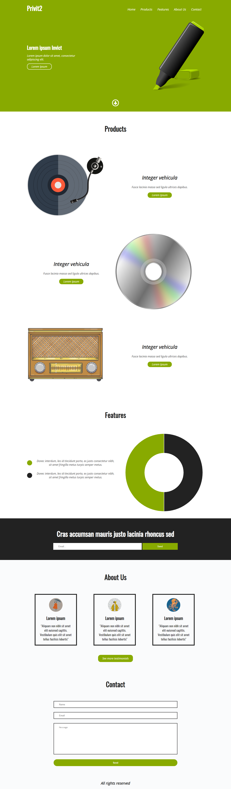

# Privit2 Landing Page
Essa é a Privit2 Landing Page, trata-se de uma página estática em HTML que oferece uma visão completa sobre uma empresa fictícia chamada Privit2 e seus produtos. Você pode utilizar esse código como base para criar sua própria landing page, personalizando-a de acordo com suas necessidades e objetivos.
<br>
<br>


# Recursos
A página "Privit2" possui os seguintes recursos:

- Design responsivo que se adapta a diferentes tamanhos de tela e dispositivos.
- Menu de navegação com links para as seções da página.
- Seção "Products" que exibe informações sobre os produtos da Privit2, incluindo imagens e descrições.
- Seção "Features" que destaca os recursos e benefícios dos produtos.
- Gráfico interativo na seção "Features" para visualizar dados relevantes.
- Seção de chamada para ação (CTA) com um formulário de inscrição por e-mail.
- Seção "About Us" que apresenta informações sobre a empresa e depoimentos.
- Seção de contato com um formulário para enviar mensagens.
- Rodapé com informações de direitos autorais.

# Tecnologias
As seguintes tecnologias foram utilizadas para criar a página "Privit2":

- HTML5: A marcação semântica HTML foi usada para estruturar a página.
- CSS3: O arquivo CSS foi utilizado para estilizar os elementos da página.
- JavaScript: O JavaScript foi utilizado para adicionar interatividade, como a funcionalidade do menu mobile e o gráfico na seção "Features".
- Font Awesome: A biblioteca Font Awesome foi usada para os ícones usados na página.
- Chart.js: A biblioteca Chart.js foi usada para renderizar o gráfico interativo na seção "Features".
- jQuery: A biblioteca jQuery foi utilizada para simplificar a manipulação do DOM e a interação com elementos da página.

# Utilização

Para utilizar essa Landing Page na sua máquina siga os seguintes passos:

- Clone o repositório para sua máquina local utilizando o seguinte comando:
```bash
  git clone https://github.com/ViniciusQuintas/privit2-landing-page.git
```
- Após clonar o repositório, navegue até o diretório da Landing Page no terminal:
```bash
  cd privit2-landing-page
```
- Agora, abra o arquivo index.html no seu navegador para visualizar a página em ação.

# Contribuição
Se você deseja contribuir para o desenvolvimento dessa Landing page, siga os seguintes passos:

1️⃣ Faça um fork deste repositório. 
<br>
<br>
2️⃣ Crie uma nova branch para sua contribuição. 
<br>
<br>
3️⃣ Faça suas alterações no código. 
<br>
<br>
4️⃣  Certifique-se de que suas alterações não quebram o funcionamento existente da página. 
<br>
<br>
5️⃣ Faça um pull request com suas alterações. 
<br>
<br>

# Licença
Este projeto está licenciado sob a Licença MIT. Consulte o arquivo LICENSE para obter mais informações.
